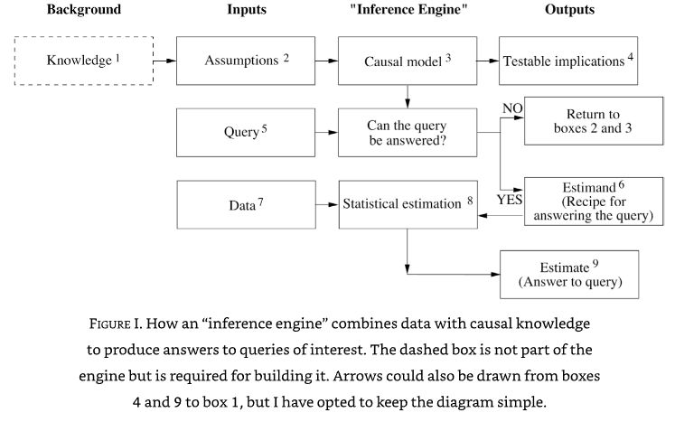

# Introduction

#Causal-Inference

We naturally think in a causal way. If we understand the logic behind causal thinking, we could emulate it on modern computers, and create an "artificial scientist".

*"Lucky is he who has been able to understand the causes of things"* Virgil, 29 BC.

Data is not enough for causal inference work.

Causal inference has two parallel approaches:

1. Causal diagrams (directed acyclic graphs)
2. Symbolic language for mathematical approach

These approaches should make clear what assumptions are being made, and what questions are being asked. 

The causal model should depict (qualitatively and/or quantitatively) the process that generates the observed data.

An example of the symbolic language, for asking how a drug, D, affects lifespan, L, is:

$P(L | do(D))$, with a control group of $P(L | do(not D))$

The *do* operator signifies that we are dealing with an intervention.

## The inference engine

A blueprint of an inference engine is shown above. Such an engine needs three kinds of input:

1. Data
2. Assumptions (often come from prior knowledge, which is simplified/structured into assumptions)
3. Queries (such as $P(L | do(D))$)

The causal model may be in several forms, such as:

* Causal diagram
* Structure equations
* Logical statements

The causal model aims at mimicking the processes that lead to the data, and can be tested for "degree of fitness" - the degree to which the data are compatible with the model's assumptions.

It produces three kinds of output:

1. A *yes/no* on whether a query can be answered under the current causal model, assuming sufficient data.
2. An *Estimand* ('that to be estimated') - the mathematical formula for generating the answer from the input data. For example $P(L | do(D))$ may be estimated by conditioning $P(L|D)$ on other variables, $Z$, as in $P(L | D,Z).P(Z)$. The estimand is the assumed mathematical causal model.
4. An *Estimate* of the causal effect in question (we should also look for uncertainty due to sampling).

Some questions may not be answered, such as if we know variable $Z$ affects both $D$ and $L$, but we have no measurement of $Z$. In such a case we may need to say the causal effect cannot be answered, or can only be answered by making a simplifying assumption that the effect of $Z$ is negligible.

## Data

The causal model should ideally be produced *before* collecting data (and deciding what data to collect). The estimand can be designed before data is collected.

## Causality in plain English

*"We think of a cause as something that makes a difference, and the difference it makes must be the difference from what would have happened without it"* (David Lewis, putting counter-factuals at the heart of our intuition about causality).