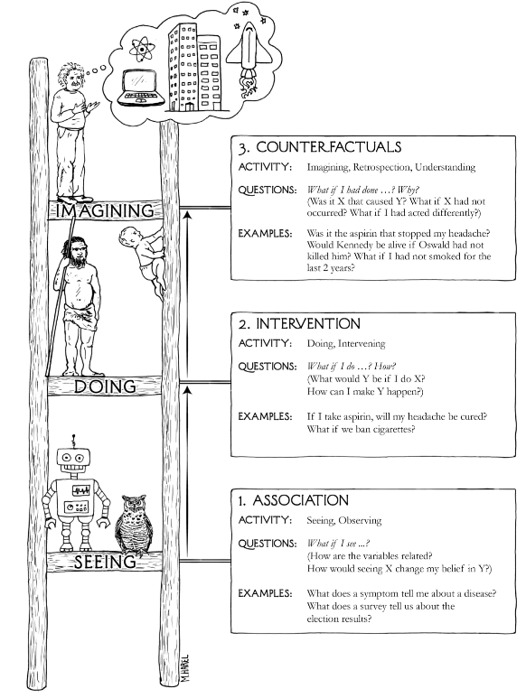
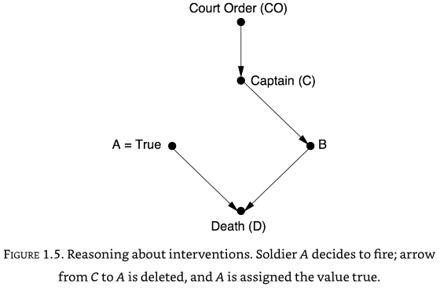
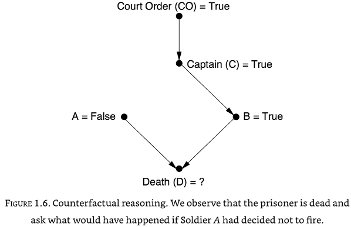

# The ladder of causation

#Causal-Inference 

*"Probabilities, even conditional probabilities, alone encode our beliefs about a static observed world, causality tells us whether probabilities change when the world changes - be it by intervention or by act of imagination."*

* Causal explanations make up the bulk of our knowledge.
* Causal understanding allows us to manipulate our environment.
* We can imagine 'what if?' counter-factual scenarios in a mental model that includes multiple variables.
* Causal understanding involves seeing, doing (and learning from experience), and imagining.
## Three levels of causation

1. **Association**: Seeing. We look for patterns in the data. How are variables related? One event is associated with another if changing one ($A$) changes the likelihood of seeing another ($B$). We can write this as $P(B|A)$ - what is the probability of seeing $B$ given that we see $A$. Machine learning works at this level. Predictions can be very accurate, but cannot go outside of the observed data.
2. **Intervention**: Doing/changing. "*What happens if I do X?*" Intervention can create new conditions not present in the original data, or can break existing associations in the data. If the existing data has all the necessary data, then a causal model allows us to use existing data to ask interventional questions - what is the probability of $B$, of I do $A$, or $P(B|do(A))$. The accuracy of the answer will depend on the accuracy of the causal model. Related to this is asking how much do I need to change $A$ to achieve $B$. This rung of the ladder is restricted to the observed world.
3. **Counterfactuals**: Imagining hypothetical situations. Causal models, such as understanding physical laws, allows to ask "*What if things had been different?*" or "*Why did X happen?"* This rung of the ladder can allow us to go outside of the observed world.

## The mini Turing test
For a machine to pass a mini Turing test for causal inference, we would need to think how a machine can acquire causal knowledge:

* **How can machines (and people) represent causal knowledge in a way that would enable them to access the necessary information swiftly, answer questions correctly, and do it with ease.**

For this we need a compact method of representing the causal knowledge. This can be done with a causal diagram, such as one for a firing squad:

From the causal diagram we can see that if A fires, then B must also have fired. But a causal diagram can be used to ask causal questions such as what would happen if A decided to fire by itself. In these causal questions, we break any connections to A:

In this case we can see D would die, but B would not fire. Even though in observed data A and B always fire together, in out causal 'what if?' scenario we can see that B firing is not dependent on A firing.

We can also answer the question "What if A decided not to fire - would D be alive or dead?". The causal diagram shows that B by itself can cause D to die.

## Probabilities and causation

Conditional probabilities, such as $P(Y|X)$ do not show or imply causation. For example parallel changes in $X$ and $Y$ may be caused by a confounder. A **confounder** is a **common cause**. If $Z$ causes changes in both $X$ and $Y$, then $X$ and $Y$ will appear to have dependence on each other. 

It is possible to eliminate confounders (also called *background factors*, $K$) by conditioning upon them: $P(X|Y, K=k)$. The challenge, however, is knowing which background factors to condition upon; this cannot be derived from data alone as data alone does not show casual links, and confounding is a causal phenomenon. It has been suggested though that we should condition on any factor that is '*causally relevant*'.

To describe causal relationships we should use the *do* operator. We can say $X$ causes $Y$ if  $P(Y|do(X)) > P(Y)$.

## YouTube

Machine learning with ‘big data’: fundamental limitations and Pearl’s ‘ladder of causation’: https://youtu.be/-7vSiWRasxY

Judea Pearl: Causal Networks: https://youtu.be/ub98C4OUD0E

