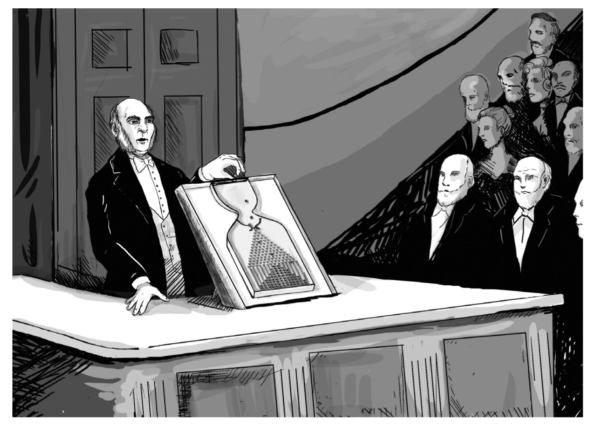
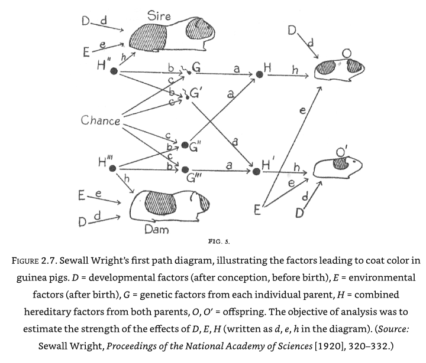

# From Buccaneers to Guinea Pigs: The genesis of Causal Inference

## Francis Galton and Karl Pearson

Galton's '*quincunx*' or '*Galton board*' showed how individual random events produced a reproducible population on frequencies. A series of left/right random events lead to a normal distribution of frequencies. Galton used this as a model of inheritance - each generation inherits from the previous generation but can be a little to either side. But inherited distributions, such as height, do not get wider with successive generations. To fix this Galton had to add a layer which brought balls back closer to the centre - a law of 'regression to the mean' (or 'regression toward mediocrity').

Galton found that fathers and sons heights were co-related, or correlated. But the relationship and the tendency towards the mean was bidirectional - a tall son is likely to have a taller than average father, but not as tall as the son, and vice versa. This co-relation could not therefore be interpreted as directly causal (as the son can not cause attributes of the father). 

In Galton's model the next generation inherits the 'chance' that applied to the previous generation. But this is wrong - 'chance' is additive to inheritance, but it is not passed on to the next generation (though perhaps a vestige of chance is, with things like success?).

Karl Person saw causation as just a special case of correlation (that he had developed); causation set the natural limit to correlation. Pearson believe causation could not be proved scientifically - that what people saw as causation was just a repetition of sequence, but there was no proof that the sequence must always repeat in the future.

## Sewall Wright

Sewall Wright was investigating genetics - looking at colour patterns in guinea-pigs.

Inheritance of colour patches did not appear to follow Mendelian rules - it was not possible to fix colour patterns by in-breeding. Wright proposed that 'developmental factors' in the womb were causing some of the variations.

Wright framed this as a mathematical problem with $d$ (developmental) and $h$ (hereditary) values to be determined. To work out the algebra needed he drew things out as a *path diagram*:

Wright showed that in a randomly bred population of guinea pigs, 42% of the variation was due to developmental factors, and 42% due to hereditary. In a highly inbred family only 3% of variation was due to hereditary, and 92% was due to developmental factors. *Chance* in the above diagram relates to which genes are passed from mother/father (this was not a mechanism understood at the time).

The path diagram is powerful as the the coefficients along a path may be multiplied to get the strength of each path. Omitted arrows communicate that there is no causal link.

When relationships are not known, Wright argued that the causal path diagram can be used to test hypothesised causal paths - if the hypothesised path does not predict the actual data then that path may be dismissed. **Causal path diagrams always require some causal hypothesis.** 

## A worked example by Wright

How much does a guinea-pig pup grow in the womb just before birth?

A simple look at the data suggests that guinea-pigs born with an extra day of gestation are 5.66g heavier. But guinea-pigs born later tend to come from smaller litter sizes which also affects growth. How do we disentangle these things?

**The causal effect is the product of coefficients along a given causal path.** 

* The direct path is represented by path P -> X, or the coefficient $p$.
* The bias due to litter size, L, is the paths P <- L -> Q -> X. The bias is the product of the path coefficients along those paths, or $l.l'.q$. 
* The total correlation is the sum of the direct path and the litter size path, or $p + (l.l'.q) = 5.66$
* We can measure the correlations of the pairs (P, X), (L, X), (L,P), and algebraically we can then calculate $p$, $l'$, and $l.q$.
* Wright solved this to show that $p$ was 3.34g per day, teasing apart growth rate due to gestation from the effect on litter size.
