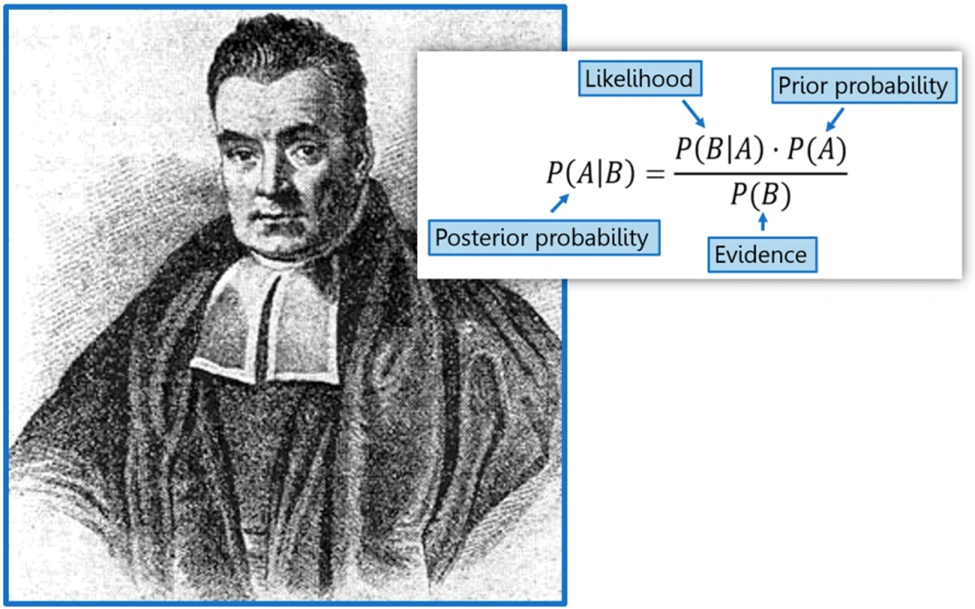
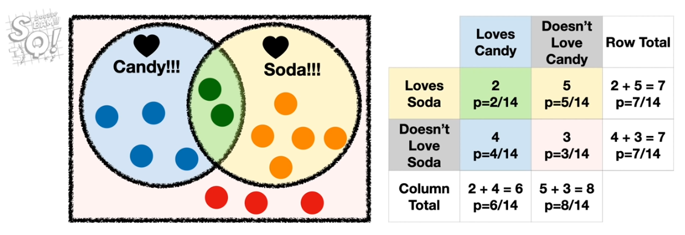
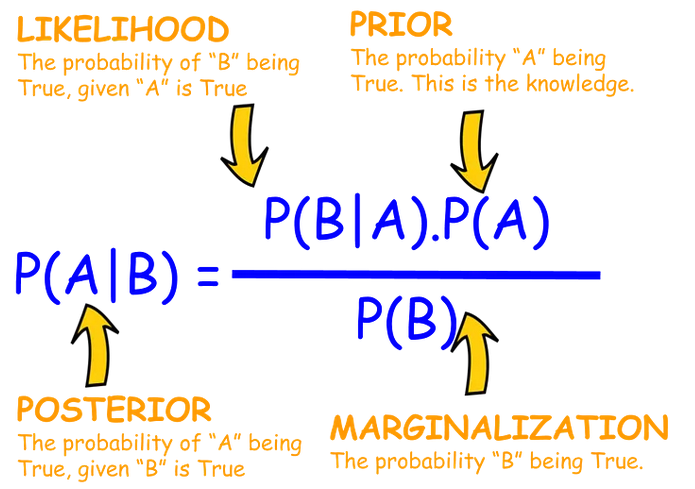
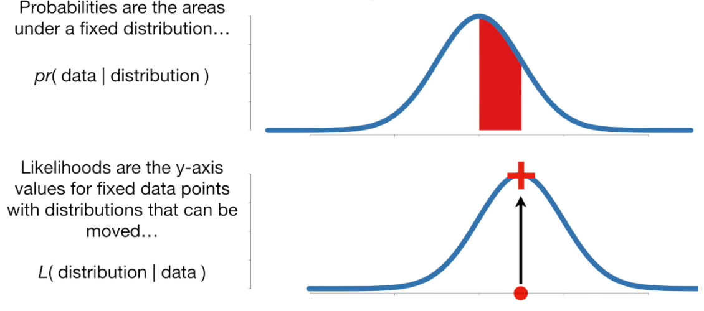
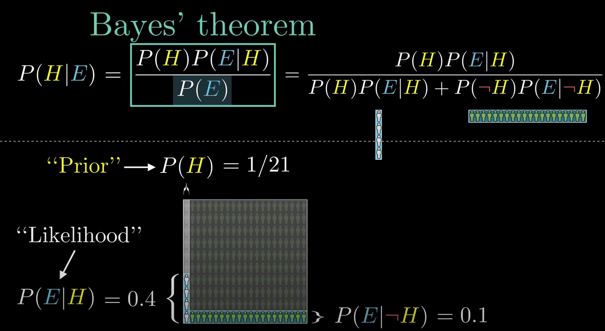
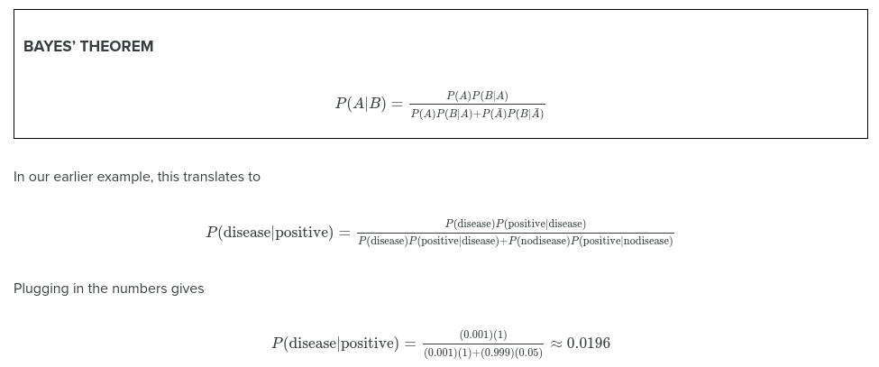

# Bayes and causal inference

#Bayes #Causal-Inference 

See also [[04_Bayesianism]]

Rev Thomas Bayes 1702-1761.

Bayes genius was to calculate the probably of a cause (the hypothesis) from the occurrence of an effect (the evidence). In Bayes' day this was known as *inverse probability*.
## Induction and deduction

**Induction**: Evidence to hypothesis; generalising from observation.  Example of an inductive argument: "All ravens I have seen are black. Therefore ravens are black."

**Deduction**: Hypothesis to conclusion; applying what is known. Example of a deductive argument: "All noble gasses are stable. Neon is a noble gas. Therefore neon is stable." Multiple hypotheses may be generated (by induction), and their conclusions checked against the facts; "When you have eliminated the impossible, whatever remains, however improbable, must be the truth" (Sherlock Holmes).

## Bayes theorem classification

From StatQuest...

### Bayes theorem
https://youtu.be/9wCnvr7Xw4E

We can use conditional probabilities to answer questions like "What is the probability of someone not loving candy if they love soda?"

*p(not love C & love S | love S) = p(not love C & love S) / p(love S) = 0.71*

Note: Stating *not love C & love S* when we have conditioned upon *love S* can be seen as redundant, and can be shorted to *p(not love C | love S)*, but writing out in full can help get the calculation right!

With Bayes theorem we do not need to know all probabilities:

$P(A|B) = \frac{P(B|A)\times P(A)}{P(B)}$

The *marginalization* is the combined probability of B if the hypothesis (A) is true, or not true:
* P(B) = P(A)P(B|A) + P(¬A)(B|¬A)

*Likelihood / marginalisation* is also known as the *likelihood ratio* - that is how much more likely is B given that A is true.

We need to know one conditional; probability, P(B|A), but we construct the calculation so we use the conditional probability we can more readily estimate (what would the world look like if the hypothesis were true) in order to calculate the conditional probably that is harder to measure. We also need to observe the frequency of our evidence, B, and we need to start with a prior estimate of our hypothesis, A.

Bayes may also be applied to 'strength of belief' in  a hypothesis, where new evidence, which gives us P(B) (or at least an estimate of it) is used to update confidence in hypothesis, A.           

### Probability and likelihood
https://youtu.be/pYxNSUDSFH4
	
* *Probability*: Given a fixed distribution, what is the probability of a given observation. Probabilities are areas under a fixed distribution: $pr(data|distribution)$.
 
* *Likelihood*: Given a fixed observation, what is the likelihood of seeing that observation with the given distribution? $L(distribution|data)$.

## A worked example

We are told a person is shy and likes to keep things tidy. Are they most likely a librarian?

* Let us assume there are 20X more farmers than librarians (our population is a librarian + 21 farmer)
	* Our Prior, *P(H)*, of it being a librarian is therefore 1/21
* But librarians are 4X more likely to be shy and tidy, compared to farmers
* Let us perform calculations based on  a population of 10 librarians and 200 farmers:
	* Our Hypothesis is that we are looking at a librarian
	* The probability of the evidence if our hypothesis is true, P(E|H) is 0.4
		* Multiplied by the prior probability of the hypothesis being true, *P(H, 1/21)*  = 0.0190
	* The probability of the evidence if our hypothesis is false, P(E|¬H) is 0.1
		* Multiplied by the prior probability of the hypothesis being false, *P(¬H, 20/21)* = 0.0952
	* The overall probability of seeing the evidence is therefore:
		* (1/21 x 0.4) + (20/21 * 0.1) = 0.1143
	* The probability of the hypothesis being true, given the evidence:
		* 0.0190 / 0.1143 = 0.167
	* Given the evidence (a shy tidy person), but also given our prior knowledge of the ratio of librarians to farmers, there is only a 16.7% probability the person described is a librarian.

* Another way of looking at this is to ask of all the cases where E is true (20 farmers + 4 librarians), what proportion are librarians = 4/24 = 0.167.

## Another worked example

* A disease has a incidence rate in the general population of 0.1%.
* A test has been developed:
	* 100% sensitivity: P(positive|disease) = 1.0
	* 5% false positive: P(positive|no disease) = 0.05
* Suppose a randomly selected person has the test and it is positive, what is the probability that they actually have the disease?
	* We want to compute P(disease|positive)
	* Let's imagine 1000 people
	* 1 person will have the disease, 999 do not
	* The 1 disease person will test positive
	* Of 999 non-positive ~50 will test positive
	* So 1 real disease out of 51 non-disease positive
	* = 1/51= 0.0196 = ~2%

## Naive Bayes (Multinomial Naive Bayes)
https://youtu.be/O2L2Uv9pdDA

Spam example: 
* Start with *prior probability* of a message being normal or spam (e.g. use proportion of messages that are spam).
* Multiply by the probabilities of each word being in a normal or spam message.
* Resulting probabilities are proportional to the probability of being normal or spam; so take the highest probability.

But, in the above example 'lunch' is given 0 probability in spam as it has not been observed. This would mean that the resulting spam probability for a message with 'lunch' in it will always be zero, no matter the make-up of other words. To get around this people usually add a constant ($\alpha$) to all measured word frequencies in both normal and spam messages.

Naive Bayes is *naive* because it ignores word orders (it uses 'bag of words').

## Gaussian Naive Bayes Classifier
https://youtu.be/H3EjCKtlVog

Data is summarised in Gaussian distributions for each feature. Given a new case, we use the distributions to calculate likelihood for each feature value occurring for each class, and apply the naive Bayes method as above.

Using natural log values (and adding these logs) for the calculation avoids *underflow* calculation errors, where values are too low for CPU to calculate properly.
