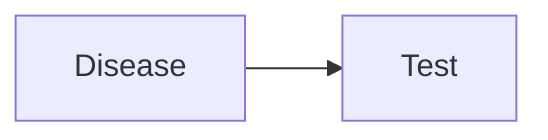
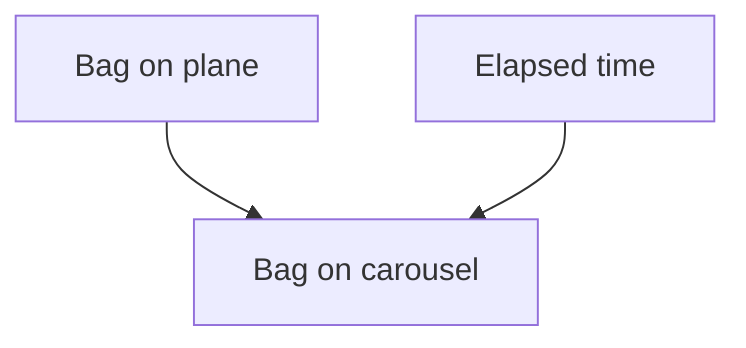
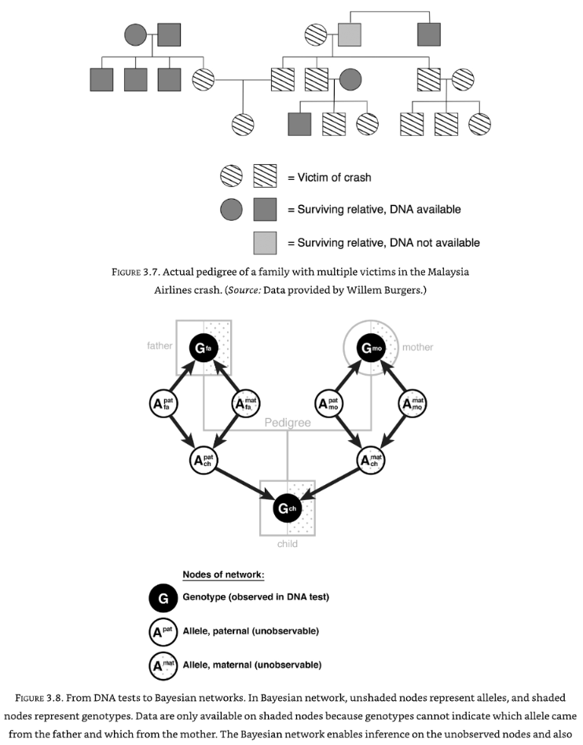

# Bayesian networks

#Bayes #Causal-Inference 

Bayesian networks links multiple nodes. Bayes theorem describes the simplest 2-node network. The next step is a 3-node network, also called a junction. There are three basic types:

* **A -> B -> C** : A chain where B  is a *mediator* between A and C. B also 'shields' C from A; A cannot directly determine C; C only *listens* to B. A and C are *conditionally independent*. This is important in programming as C only needs to be calculated based on B, and A can be ignored at this point. If we only look at instances where B has a particular value, we say we are *conditioning* upon B.

* **A <- B -> C** : This kind of junction is called a *fork*. B is also known as a common cause, or *confounder* of A and C. A confounder will make A and C statistically correlated, even though there is no direct causal link between the two (e.g. shoe size and reading ability being correlated in children, as both are caused by age).We can eliminate this *spurious correlation* (as Pearson called it), by conditioning upon C.

* **A -> B <- C** : This junction is a *collider*. In this case, conditioning on B causes a spurious correlation to appear! For example, in the example: Talent -> Celebrity <- Beauty, conditioning on Celebrity will cause Talent and Beauty to appear to be inversely correlated even though they are not correlated in the population as a whole; for any given level of Celebrity the more Talent a person has the less Beauty they will have (and vice versa) to achieve the same celebrity. This can also be known as an "*explain away*" effect; a talented actor does not need beauty, and vice versa. 

## Conditional probabilities tables

Using our example of a diagnostic test for breast cancer, applied to a 40 year old woman:

* Population incidence (next year) breast cancer: 1/700 (for 40-year old women)
* Sensitivity = 0.75
* Specificity = 0.88 (FP = 0.12)

Conditional probability table for the link between Disease and Test.

|       | T = 0 | T = 1 |
| ----- | ----- | ----- |
| D = 0 | 0.88  | 0.12  |
| D = 1 | 0.27  | 0.73      |

### Lost bag example
Let's imagine we are waiting for a bag after a flight. The probability of the bag being on the carousel depends on (1) whether the bag was on the plane, and (2) how long it has been since the plane landed:

We can measure the time it takes bags to reach the carousel, and and set up a contingency table:

|  |  | Carousel = False | Carousel = True |
| ---- | ---- | ---- | ---- |
| Bag on plane | Time elapsed |  |  |
| False | 0 | 100 | 0 |
| False | 1 | 100 | 0 |
| False | 2 | 100 | 0 |
| False | 3 | 100 | 0 |
| False | 4 | 100 | 0 |
| False | 5 | 100 | 0 |
| False | 6 | 100 | 0 |
| False | 7 | 100 | 0 |
| False | 8 | 100 | 0 |
| False | 9 | 100 | 0 |
| False | 10 | 100 | 0 |
| True | 0 | 100 | 0 |
| True | 1 | 90 | 10 |
| True | 2 | 80 | 20 |
| True | 3 | 70 | 30 |
| True | 4 | 60 | 40 |
| True | 5 | 50 | 50 |
| True | 6 | 40 | 60 |
| True | 7 | 30 | 70 |
| True | 8 | 20 | 80 |
| True | 9 | 10 | 90 |
| True | 10 | 0 | 0 |

Now we can compute the inverse probabilities, given we know that there was a 50% likelihood that the bag was on the plane. After 1 minute there is still a 47% chance that it was on the plane. After 5 minutes this drops to 33%.
``
We can plot the decreasing probability that the bag was on the plane, given how long we have waited. Notice the interesting curve to it:

## Real world example

Bayesian networks are used in the Netherlands to calculate the probability two people are related, given only partial information (and given that we do not know which genes were inherited from the father and which from the father). This was used to identify bodies in an airline crash, to ensure each one was buried by the right family. The Bayesian network allows inference of the unobservable nodes.

The Bayesian network is set up and *belief propagation* calculated, based on stating probabilities, e.g. *"this person's paternal allele for eye colour is blue"*. As new evidence is added, in any place in the network, the network cascades the effect of that new evidence through the network (both up and down, as conditional probabilities are two-way). 