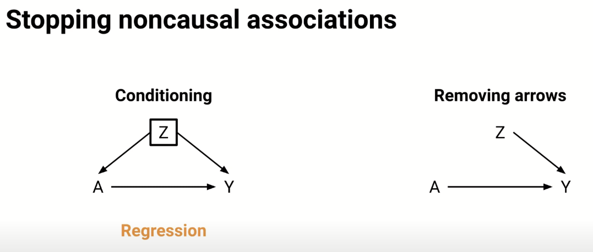

# A worked example of inverse propensity score

From: https://www.youtube.com/watch?v=PfLYPt9ur4g

## The problem:

When trying to isolate the effect (*Y*) of Treatment *A*, we need to consider the confounder *Z* that affects both the probability of receiving treatment, and the outcome from treatment.

## Observed outcomes depending on the presence/absence of the confounder and treatment

We are given the number of good outcomes (Y=1)  and bad outcomes (Y=0) for when the confounder is present (Z=1) or absent (Z=0), and whether treatment was given (A=1) or not (A=0).

When the confounder is present (Z=1), treatment is given 50% of the time. When treatment is given (when Z=1) treatment (A=1) has 90% good outcomes, and no treatment (A=0) has 30% good outcomes. 

When the confounder is absent (Z=0), treatment is given 75% of the time. When treatment is given (when Z=1) treatment (A=1) has 40% good outcomes, and no treatment (A=0) has 20% good outcomes. 

## Eliminating confounding with pseudo-populations

We eliminate confounding by predicting the outcomes for all patients with and without treatment. This creates 2 populations that are equivalent in all things apart from being given treatment.

To predict the counter-factual outcomes (e.g what would have been the outcomes if those that had not received treatment were actually given it) we assume *exchangeability* within the groups stratified by the presence/absence of the confounder. So when the confounder is present (Z=1) we assume the outcomes for the entire group (60 patients) would be the same as the outcomes for those that actually were't treated (30% good outcomes). We repeat this for when Z=0 (40 patients, where untreated will have 20% good outcomes).

We repeat the same process predicting outcomes we would expect of all patients were treated (90% good outcomes for Z=1, and 40% good outcomes for Z=0)

we now have predicted good/bad outcomes for the entire population (100 patients) with and without treatment. 

This gives us 82% good outcomes with treatment and 32% good outcomes without treatment, having removed the confounding effect of Z affecting both outcome and probability of receiving treatment.